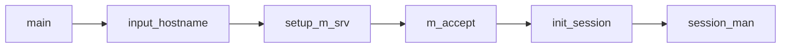
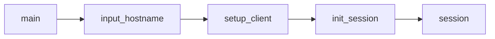

# Race_game 코드 흐름

## 1. 서버 동작 과정

```mermaid
flowchart LR
    main --> input_hostname
    input_hostname --> setup_m_srv
    setup_m_srv --> m_accept
    m_accept --> init_session
    init_session --> session_man
```

## 2. client 동작 과정

```mermaid
flowchart LR
    main --> input_hostname
    input_hostname --> setup_client
    setup_client --> init_session
    init_session --> session
```

## 3. client-서버 통신 과
